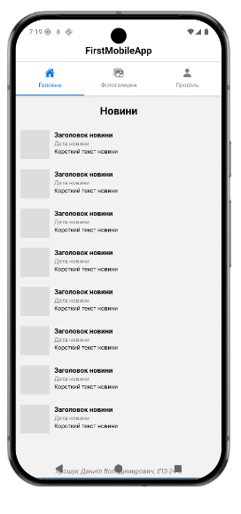
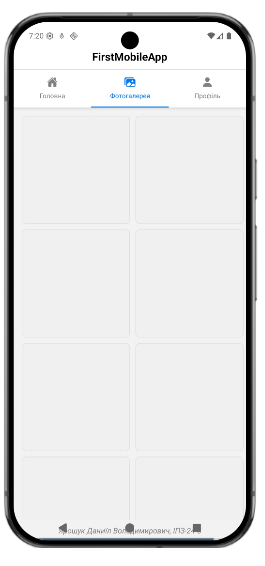
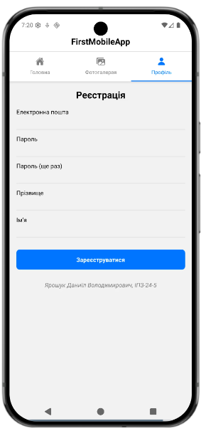

Даниїле, ось чистий варіант **README.md** без емодзі, оформлений спеціально для GitHub. Він виглядає стримано та професійно.

---

```markdown
# FirstMobileApp — Лабораторна робота №1

## Опис проєкту
Цей застосунок розроблено як частину навчального курсу для ознайомлення з основами React Native та середовищем Expo[cite: 1, 2]. [cite_start]Проєкт демонструє роботу з базовими компонентами та організацію навігації за допомогою Material Top Tabs[cite: 3, 81].

### Основний функціонал:
* Головна (Новини): Динамічний список новий із використанням FlatList[cite: 25, 29, 31].
* Фотогалерея: Адаптивна сітка зображень (Grid) на 2 колонки[cite: 25, 30].
* Профіль: Форма реєстрації з полями введення TextInput[cite: 25, 62, 69].

---

## Інструкція із запуску

### 1. Онлайн через Expo Snack
Найшвидший спосіб перевірити роботу:
1. Перейдіть за посиланням на проект у середовищі Expo Snack[cite: 22].
2. Виберіть пристрій (Android/iOS) у правій частині екрана.

### 2. Локально на вашому ПК
1. Склонуйте репозиторій:
   ```
   git clone [https://github.com/DanyilYaroshuk/MobileLabsRN2026.git](https://github.com/DanyilYaroshuk/MobileLabsRN2026.git)

```

2. Перейдіть у папку проекту: `cd lab1`.
3. Встановіть необхідні модулі:


```
npm install

```


4. Запустіть додаток через тунель:


```
npx expo start --tunnel

```

## Скріншоти застосунку
```



```
---


---

## Виконавець

* Студент: Ярошук Даниїл Володимирович 


* Група: ІПЗ-24-5 

