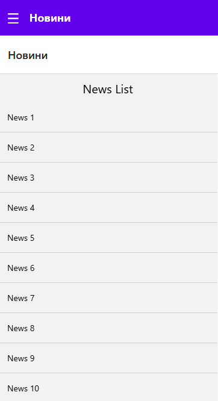
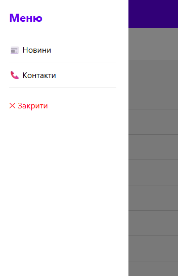
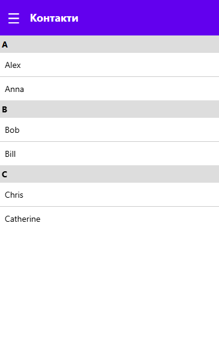

````md
# Lab 2 - React Native Navigation App

## Опис проекту

Цей проект є лабораторною роботою №2 з дисципліни Mobile Development.  
Метою роботи було створити мобільний застосунок на **React Native** з використанням **React Navigation**, реалізацією багаторівневої навігації та відображенням списків різних типів.

У проекті реалізовано:
- Drawer Navigation
- Stack Navigation
- перехід між екранами
- передача параметрів між екранами
- використання `FlatList`
- використання `SectionList`
- pull-to-refresh
- infinite scroll
- екран деталей елемента

---

## Функціональність

### 1. Drawer Navigation
У застосунку реалізовано бокове меню (**Drawer Navigator**), через яке користувач може переходити між основними розділами програми.

### 2. Stack Navigation
Для екранів новин використовується **Stack Navigator**, що дозволяє:
- переходити зі списку новин на екран деталей
- повертатися назад
- передавати дані вибраного елемента між екранами

### 3. Екран новин
На екрані новин реалізовано список через `FlatList`, який підтримує:
- відображення елементів списком
- оновлення списку через **pull-to-refresh**
- автоматичне дозавантаження нових елементів при прокручуванні (**infinite scroll**)

### 4. Екран деталей
При натисканні на новину відкривається екран деталей, де відображається повна інформація про вибраний елемент.

### 5. Екран контактів
На окремому екрані реалізовано список контактів через `SectionList`, де елементи згруповані по секціях.

---

## Структура проекту

````

---

## Основні екрани

### MainScreen

Головний екран застосунку.

### NewsScreen

Екран зі списком новин, реалізований через `FlatList`.

### DetailsScreen

Екран деталей вибраної новини.

### ContactsScreen

Екран зі списком контактів, реалізований через `SectionList`.

### CustomDrawerContent

Кастомізований вміст бокового меню Drawer.

---

## Технології

У проекті використано:

* **React Native**
* **React Navigation**
* **@react-navigation/native**
* **@react-navigation/drawer**
* **@react-navigation/stack**
* **react-native-gesture-handler**
* **react-native-reanimated**
* **react-native-safe-area-context**
* **react-native-screens**

---

## Приклад роботи

Після запуску користувач може:

1. відкрити бокове меню
2. перейти на екран новин
3. переглянути список новин
4. оновити список через pull-to-refresh
5. доскролити донизу для infinite scroll
6. натиснути на елемент і перейти на екран деталей
7. перейти на екран контактів і переглянути список через SectionList

---
## Скріншоти застосунку





---

## Висновок

У ході виконання лабораторної роботи було створено мобільний застосунок із багаторівневою навігацією.
Було освоєно використання **Drawer Navigation**, **Stack Navigation**, а також роботу зі списками `FlatList` і `SectionList`.

Застосунок демонструє базові можливості побудови структури мобільного інтерфейсу в React Native та організації навігації між екранами.

---

## Автор

Ярошук Даниїл
ІПЗ-24-5
