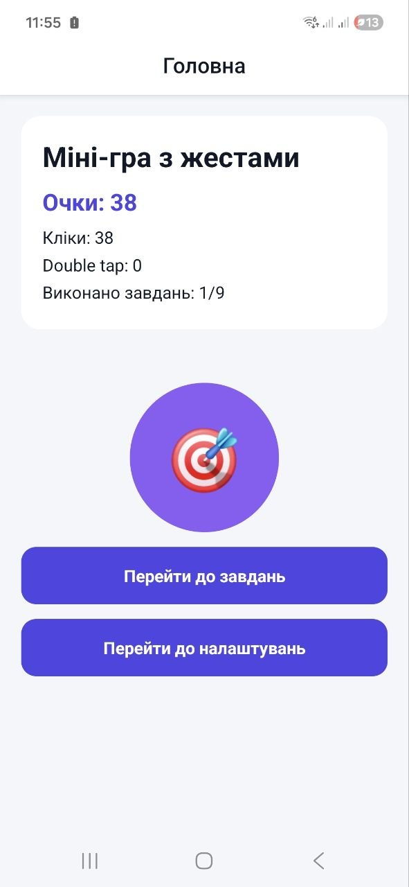
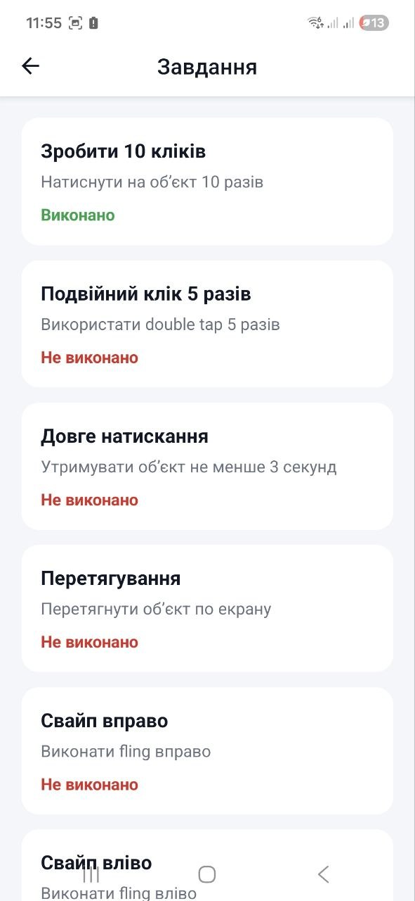
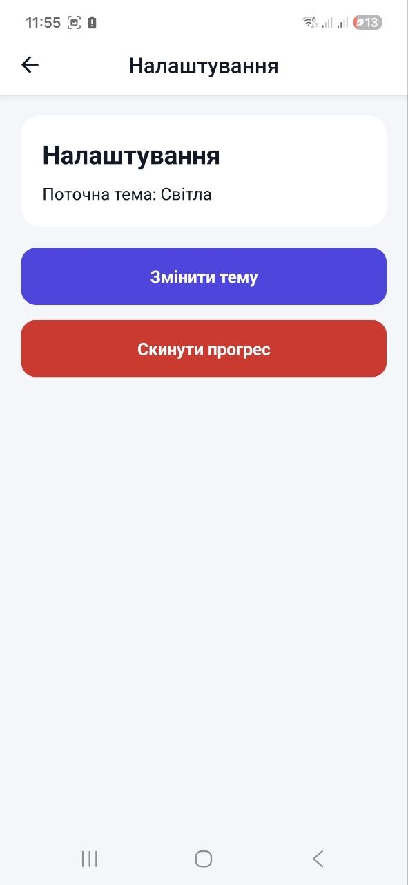
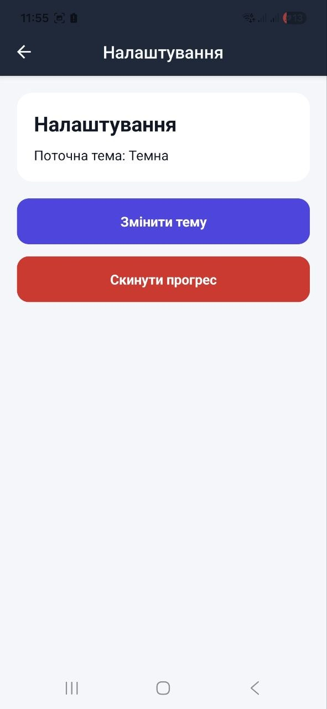

# Lab 3 - Gesture Clicker Game

## Опис проекту

Цей проект є лабораторною роботою №3 з дисципліни Mobile Development.  
Метою роботи було розробити мобільну гру-клікер, де взаємодія з об'єктом відбувається через різноманітні кастомні жести. Основний акцент зроблено на використанні бібліотеки **React Native Gesture Handler** та сучасних підходах до стилізації інтерфейсу.

У проекті реалізовано:
- Обробку простих та подвійних натискань (Tap)
- Довге утримання об'єкта (Long Press)
- Перетягування елементів по екрану (Pan)
- Швидкі свайпи (Fling)
- Масштабування об'єкта (Pinch)
- Систему ігрових завдань (Challenges) та відстеження прогресу

---

## Функціональність

### 1. Gesture Engine (Механіка жестів)
У грі реалізовано нарахування очок залежно від типу жесту:
- **Tap**: +1 бал за звичайний клік.
- **Double Tap**: +2 бали за швидке подвійне натискання.
- **Long Press**: бонусні бали за утримання кнопки протягом 3 секунд.
- **Fling (Swipe)**: отримання випадкової кількості очок (до +10) за швидкий рух вправо чи вліво.
- **Pinch**: зміна розміру об'єкта для отримання додаткових бонусів.
- **Pan**: можливість вільно переміщувати ігровий об'єкт по робочій зоні.

### 2. Система випробувань (Challenges)
Окремий екран зі списком завдань, що відстежує активність гравця:
- Натиснути на об'єкт 10 разів.
- Виконати 5 подвійних кліків.
- Утримувати об'єкт 3 секунди.
- Зробити свайпи в різні боки та змінити масштаб.
- Досягти загального рахунку у 100 очок.

### 3. Навігація та Стилізація
- Використано `@react-navigation/native` для переходу між ігровим полем, списком завдань та налаштуваннями.
- Інтерфейс стилізовано за допомогою **NativeWind** (або Styled Components), що забезпечує сучасний вигляд та підтримку темної/світлої тем.

---
## Скріншоти застосунку

---
