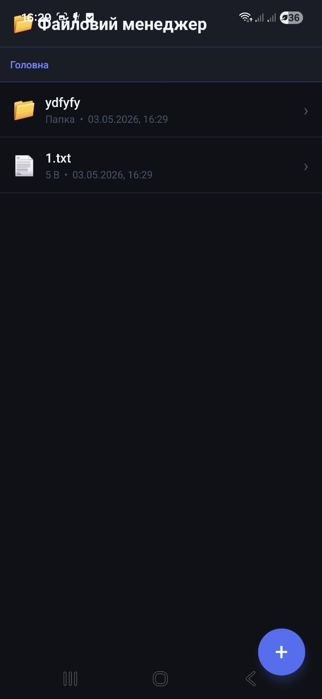

# Lab 4 - Файловий менеджер

## Опис проекту

Цей проект є лабораторною роботою №4 з дисципліни Mobile Development.  
Метою роботи було розробити мобільний застосунок «Файловий менеджер», який реалізує роботу з локальною файловою системою пристрою. 

У проекті реалізовано:

* Навігацію між папками з breadcrumb-шляхом
* Створення файлів `.txt` та папок
* Перегляд та редагування текстових файлів
* Видалення файлів і папок з підтвердженням
* Перегляд детальної інформації про файл
* Статистику використання пам'яті пристрою

---

## Функціональність

### 1. Навігація по файловій системі

* **Breadcrumb**: відображення поточного шляху з можливістю переходу до будь-якого рівня.
* **Перехід у папку**: тап на папку відкриває її вміст.
* **Кнопка «Вгору»**: повернення до попередньої директорії.
* **Головна**: швидкий перехід до кореневої директорії.

### 2. Створення файлів і папок

* Кнопка `+` (FAB) відкриває модальне вікно створення.
* Перемикач **Папка / Файл .txt** для вибору типу.
* Введення назви та початкового вмісту для `.txt` файлів.

### 3. Зчитування та редагування

* Тап на `.txt` файл відкриває вбудований текстовий редактор.
* Редагування вмісту з подальшим збереженням через кнопку **Зберегти**.
* Монопросторовий шрифт для зручного перегляду коду та тексту.

### 4. Видалення

* Довгий тап на будь-який елемент відкриває контекстне меню.
* Перед видаленням виводиться **Alert** із підтвердженням.
* Видалення папки видаляє також весь її вміст.

### 5. Детальна інформація про файл

Модальне вікно з атрибутами:

* Назва файлу
* Тип файлу (за розширенням)
* Розмір у байтах / KB / MB
* Дата останньої модифікації
* Повний шлях до файлу

### 6. Статистика пам'яті пристрою

На головному екрані відображається:

* Загальний обсяг пам'яті
* Зайнятий простір
* Вільний простір
* Прогрес-бар використання

---

## Інструкція запуску

1. Відкрити [snack.expo.dev](https://snack.expo.dev)
2. Створити файли відповідно до структури проекту нижче
3. У `package.json` вказати залежність:

```json
{
  "dependencies": {
    "@react-native-async-storage/async-storage": "2.2.0"
  }
}
```
---

## Скріншоти застосунку


|  |  |  |  |   |
